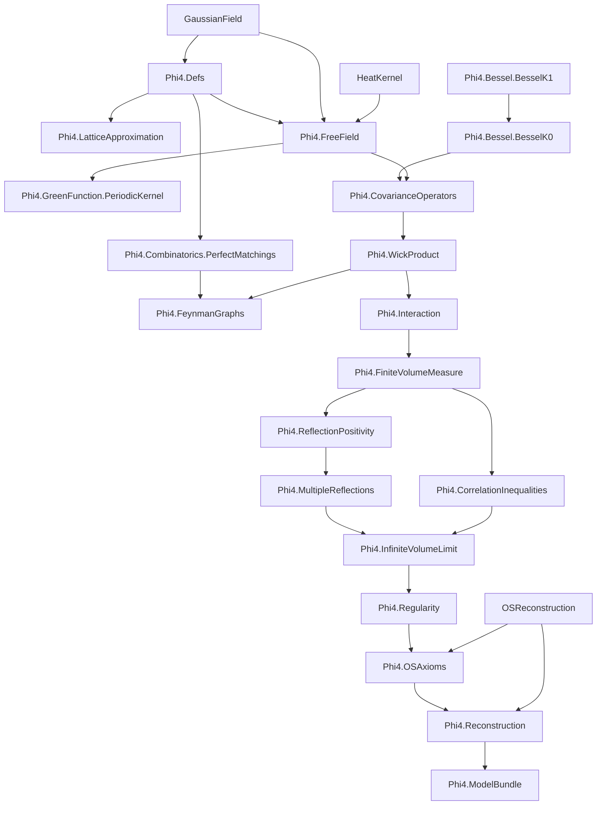

# Phi4: Formal Construction of the φ⁴₂ Quantum Field Theory

A Lean 4 formalization of constructive 2D φ⁴ Euclidean QFT, with the end goal:

1. prove Osterwalder-Schrader (OS) axioms for the infinite-volume theory, and
2. obtain the corresponding Wightman QFT.

Primary reference: Glimm-Jaffe, *Quantum Physics: A Functional Integral Point of View* (2nd ed.).

## Status Snapshot (2026-02-26)

- Core modules (`Phi4/**/*.lean`, excluding `Phi4/Scratch`):
  - theorem-level `sorry` count: `9`,
  - `axiom` declarations: `0`,
  - `def`/`abbrev`-level `sorry`: `0`.
- Scratch modules (`Phi4/Scratch/**/*.lean`) theorem-level `sorry` count: `16`.
- Build status: `lake build Phi4` succeeds.
- Trust audit script now also checks that selected interface/bundle endpoints
  (OS/reconstruction/OS4 weak-coupling outputs) do not depend on `sorryAx`.
- Per-file theorem-level `sorry` counts (core tracked files):

| File | theorem-level `sorry` count |
|---|---:|
| `Phi4/Bessel/BesselK0.lean` | 0 |
| `Phi4/Bessel/BesselK1.lean` | 0 |
| `Phi4/Combinatorics/PerfectMatchings.lean` | 0 |
| `Phi4/CorrelationInequalities.lean` | 0 |
| `Phi4/CovarianceOperators.lean` | 0 |
| `Phi4/Defs.lean` | 0 |
| `Phi4/FeynmanGraphs.lean` | 0 |
| `Phi4/FiniteVolumeMeasure.lean` | 0 |
| `Phi4/FreeField.lean` | 0 |
| `Phi4/GreenFunction/PeriodicKernel.lean` | 0 |
| `Phi4/HonestGaps.lean` | 0 |
| `Phi4/InfiniteVolumeLimit.lean` | 1 |
| `Phi4/Interaction.lean` | 0 |
| `Phi4/LatticeApproximation.lean` | 0 |
| `Phi4/ModelBundle.lean` | 0 |
| `Phi4/MultipleReflections.lean` | 0 |
| `Phi4/OSAxioms.lean` | 3 |
| `Phi4/Reconstruction.lean` | 2 |
| `Phi4/ReflectionPositivity.lean` | 0 |
| `Phi4/Regularity.lean` | 3 |
| `Phi4/WickProduct.lean` | 0 |
- Open frontiers are now explicit theorem-level gaps (`gap_...` theorems) rather than `def` placeholders.
- `Phi4/HonestGaps.lean` now forwards to canonical core frontiers and carries no local `sorry`.
- FKG-derived connected two-point nonnegativity now requires nonnegative test functions (mathematically correct direction).
- Pairing/perfect-matching combinatorics has been factored into `Phi4/Combinatorics/PerfectMatchings.lean`.
- `PairingEnumerationModel` now assumes only the pairing-cardinality formula; finite enumeration is canonical (`Finset.univ`).
- Boundary covariance assumptions are now layered into kernel/comparison/regularity subinterfaces with compatibility instances from `BoundaryCovarianceModel`.
- Dirichlet reflection-positivity assumptions now depend on `BoundaryKernelModel` (minimal kernel data) rather than the full boundary covariance bundle.
- `Phi4ModelBundle` now stores boundary kernel/comparison/regularity components directly, with `BoundaryCovarianceModel` reconstructed by instance.
- `Phi4/GreenFunction/PeriodicKernel.lean` adds concrete periodic image-sum kernel infrastructure (lattice shifts and truncated torus-image sums).
- Correlation assumptions are now split into `CorrelationTwoPointModel`, `CorrelationFourPointModel`, and `CorrelationFKGModel`, with compatibility reconstruction to `CorrelationInequalityModel`.
- `Phi4ModelBundle` now stores these three correlation submodels directly; the full correlation model is reconstructed by instance.
- Infinite-volume assumptions are now split into `InfiniteVolumeSchwingerModel` and `InfiniteVolumeMeasureModel`, with reconstruction to `InfiniteVolumeLimitModel`.
- `InfiniteVolumeLimit.lean` and `Reconstruction.lean` now use `InfiniteVolumeSchwingerModel` as the minimal assumption for inequality/convergence blocks that do not require measure representation.
- `InfiniteVolumeLimit.lean` now includes constructive two-point exhaustion lemmas that discharge the explicit boundedness hypothesis from `MultipleReflectionModel`:
  `schwingerTwo_uniformly_bounded_on_exhaustion`,
  `schwingerTwo_tendsto_iSup_of_models`,
  `schwingerTwo_limit_exists_of_models`,
  plus lattice and `schwingerN` (`k = 2`) model-driven convergence/existence variants,
  and interface-shaped `if h : 0 < n then ... else 0` convergence/existence theorems
  for two-point and `k = 2` `schwingerN` sequences, including
  `infinite_volume_schwinger_exists_two_of_models` and
  `infinite_volume_schwinger_exists_two_of_lattice_models`.
- `InfiniteVolumeLimit.lean` now includes general infinite-volume permutation
  symmetry transfer:
  `infiniteVolumeSchwinger_perm`, with
  `infiniteVolumeSchwinger_two_symm` derived as a corollary.
- `InfiniteVolumeLimit.lean` now provides infinite-volume connected two-point
  linearity/bilinearity infrastructure (left/right additivity and scalar
  linearity, plus `connectedTwoPointBilinear`,
  `connectedTwoPointBilinear_symm`, and
  `connectedTwoPointBilinear_self_nonneg`) transferred from finite volume
  via exhaustion convergence, and now uses this bilinear infrastructure in the
  infinite-volume quadratic nonnegativity statement.
- `Phi4ModelBundle` now stores `InfiniteVolumeSchwingerModel` and `InfiniteVolumeMeasureModel` directly; full `InfiniteVolumeLimitModel` is reconstructed by instance.
- `MeasureOS3Model` now depends only on the infinite-volume Schwinger+measure subinterfaces (not the full infinite-volume bundle).
- `OSAxiomCoreModel`, `OSE4ClusterModel`, and `OSDistributionE2Model` are now decoupled from `InfiniteVolumeLimitModel`; they are pure Schwinger-package interfaces.
- `Reconstruction.lean` now uses `InfiniteVolumeSchwingerModel` (instead of `InfiniteVolumeLimitModel`) for weak-coupling decay and reconstruction interface classes.
- Reconstruction assumptions are now split into
  `ReconstructionLinearGrowthModel` and `ReconstructionWeakCouplingModel`
  (with compatibility reconstruction of `ReconstructionInputModel`).
- `ReconstructionWeakCouplingModel` is now derivable from
  `UniformWeakCouplingDecayModel` by instance
  (`reconstructionWeakCouplingModel_of_uniform`), reducing duplicated weak-coupling interface obligations.
- `ConnectedTwoPointDecayAtParams` now uses a physically sound decay shape:
  one uniform mass gap with pair-dependent amplitudes (`C_{f,g}`), rather than
  a single global amplitude constant for all test-function pairs.
- `Reconstruction.lean` now includes an interface-level trusted endpoint
  `phi4_wightman_exists_of_interfaces`, and
  `Phi4/ModelBundle.lean` routes `phi4_wightman_exists_of_bundle` through this
  interface theorem (instead of the frontier-gap `phi4_wightman_exists`).
- `Reconstruction.lean` now includes trusted interface-level downstream
  corollaries:
  `phi4_selfadjoint_fields_of_interfaces`,
  `phi4_locality_of_interfaces`,
  `phi4_lorentz_covariance_of_interfaces`,
  `phi4_unique_vacuum_of_interfaces`, with matching bundle wrappers in
  `ModelBundle.lean`.
- `Reconstruction.lean` now derives an explicit `ε`-`R` clustering form from
  exponential connected two-point decay
  (`connectedTwoPoint_decay_eventually_small`), plus the weak-coupling
  threshold specialization
  (`phi4_connectedTwoPoint_decay_below_threshold_eventually_small`) and an
  explicit-Schwinger variant
  (`phi4_connectedTwoPoint_decay_below_threshold_eventually_small_explicit`),
  with bundled wrappers in `ModelBundle.lean`.
- `Reconstruction.lean` now also provides global weak-coupling `ε`-`R` forms
  (`phi4_os4_weak_coupling_eventually_small` and
  `phi4_os4_weak_coupling_eventually_small_explicit`) derived from
  `UniformWeakCouplingDecayModel`, with bundled wrappers.
- `ModelBundle.lean` now also exposes bundled wrappers for the base global OS4
  weak-coupling decay forms
  (`phi4_os4_weak_coupling_of_bundle`,
  `phi4_os4_weak_coupling_explicit_of_bundle`) in addition to the `ε`-`R`
  variants.
- `translateTestFun` is now a public helper in `Reconstruction.lean`, so
  downstream theorem signatures can reference translated test functions
  directly without private-name leakage.
- `OSAxioms.lean` now includes `phi4_os1_of_interface` (trusted OS1 interface
  path), with `phi4_os1_of_bundle` exposed in `ModelBundle.lean`.
- `Phi4ModelBundle` now stores reconstruction linear-growth and global
  weak-coupling decay data directly; fixed-parameter weak-coupling thresholds
  are reconstructed by instance (`reconstructionWeakCouplingModel_of_uniform`).
- Several deep analytic/reconstruction steps are currently represented via explicit assumption interfaces (`...Model` classes), not placeholders.
- Upstream `OSReconstruction` currently emits `sorry` warnings in some modules; this project treats reconstruction as an explicit input assumption at the final handoff point.

## Project Objective

Formalize a mathematically sound pipeline for φ⁴₂:

1. finite-volume construction,
2. infinite-volume limit,
3. OS axiom verification,
4. reconstruction to Wightman theory.

## Comprehensive Lean Module Dependency Graph



## End-to-End Proof Flowchart (Mathematical)

```mermaid
flowchart LR
  A[Free Gaussian field dφ_C on S'(R²)] --> B[Wick ordering and φ⁴ interaction V_Λ]
  B --> C[Finite-volume measure dμ_Λ = Z_Λ^{-1} e^{-V_Λ} dφ_C]
  C --> D[Correlation inequalities: GKS/FKG/Lebowitz]
  C --> E[Reflection positivity in finite volume]
  E --> F[Multiple reflections / chessboard bounds]
  D --> G[Monotonicity in Λ]
  F --> H[Uniform bounds in Λ]
  G --> I[Infinite-volume Schwinger limit]
  H --> I
  I --> J[Regularity / generating-functional bounds (OS1)]
  I --> K[OS0/OS2/OS3 packaging]
  J --> K
  K --> L[OS axioms package]
  L --> M[Wightman reconstruction input]
```

## Assumption Interface Layer (Current)

Some high-complexity components are intentionally exposed as structured assumptions to keep downstream development rigorous and explicit:

- `BoundaryKernelModel`
- `BoundaryComparisonModel`
- `BoundaryRegularityModel`
- `InteractionIntegrabilityModel`
- `InteractionUVModel`
- `InteractionWeightModel`
- `FiniteVolumeComparisonModel`
- `CorrelationTwoPointModel`
- `CorrelationFourPointModel`
- `CorrelationFKGModel`
- `InfiniteVolumeSchwingerModel`
- `InfiniteVolumeMeasureModel`
- `FreeReflectionPositivityModel`
- `DirichletReflectionPositivityModel`
- `InteractingReflectionPositivityModel`
- `MultipleReflectionModel`
- `InfiniteVolumeLimitModel`
- `WickPowersModel`
- `RegularityModel`
- `OSAxiomCoreModel`
- `OSE4ClusterModel`
- `OSDistributionE2Model`
- `MeasureOS3Model`
- `ReconstructionLinearGrowthModel`
- `ReconstructionWeakCouplingModel`
- `ReconstructionInputModel`

Compatibility instances reconstruct:
- `CorrelationInequalityModel` from the three correlation submodels.
- `BoundaryCovarianceModel` from boundary kernel/comparison/regularity submodels.
- `InfiniteVolumeLimitModel` from Schwinger + measure submodels.
- `ReconstructionInputModel` from linear-growth + weak-coupling submodels.

`Phi4.ModelBundle` collects these interfaces into one bundled entrypoint.

## File Map (Purpose)

| File | Purpose |
|------|---------|
| `Phi4/Defs.lean` | Core types and geometric/setup data |
| `Phi4/LatticeApproximation.lean` | Rectangular lattice geometry, discretization, and Riemann-sum infrastructure |
| `Phi4/Combinatorics/PerfectMatchings.lean` | Perfect matching / pairing combinatorics for Wick expansions |
| `Phi4/GreenFunction/PeriodicKernel.lean` | Periodic method-of-images kernel shifts and truncated lattice sums |
| `Phi4/FreeField.lean` | Free Gaussian field and covariance CLM infrastructure |
| `Phi4/Bessel/BesselK1.lean` | Bessel K1 technical lemmas |
| `Phi4/Bessel/BesselK0.lean` | Bessel K0 definitions and bridge lemmas |
| `Phi4/CovarianceOperators.lean` | Covariance operators and comparison skeleton |
| `Phi4/WickProduct.lean` | Wick monomials and rewick identities |
| `Phi4/FeynmanGraphs.lean` | Graph-expansion interface layer |
| `Phi4/Interaction.lean` | Interaction and integrability interface |
| `Phi4/FiniteVolumeMeasure.lean` | Finite-volume measure and Schwinger moments |
| `Phi4/CorrelationInequalities.lean` | GKS/FKG/Lebowitz interfaces and derived bounds |
| `Phi4/ReflectionPositivity.lean` | Time reflection and RP interfaces |
| `Phi4/MultipleReflections.lean` | Chessboard and determinant-style bounds |
| `Phi4/InfiniteVolumeLimit.lean` | Exhaustion, monotonicity, infinite-volume model interface |
| `Phi4/Regularity.lean` | Regularity / OS1 interface |
| `Phi4/OSAxioms.lean` | OS axiom packaging for φ⁴₂ Schwinger functions |
| `Phi4/Reconstruction.lean` | Wightman existence via explicit reconstruction input |
| `Phi4/ModelBundle.lean` | Bundled model assumptions for end-to-end use |

## Build

Requires Lean `v4.28.0`.

```bash
lake build Phi4
```

## Trust / Audit Commands

`scripts/check_phi4_trust.sh` now includes a theorem-dependency guard for
trusted endpoints (`#print axioms` check, rejecting `sorryAx`).

```bash
scripts/check_phi4_trust.sh
rg -n "^[[:space:]]*axiom\\b" Phi4 --glob '*.lean'
grep -RIn "^[[:space:]]*sorry\\b" Phi4 --include='*.lean'
lake build Phi4
```

## Planning Docs

- `TODO.md` — active engineering queue and dependency-aware plan.
- `ProofIdeas/` — chapter-wise mathematical planning notes.

## References

- J. Glimm, A. Jaffe, *Quantum Physics: A Functional Integral Point of View*, 2nd ed.
- B. Simon, *The P(φ)₂ Euclidean (Quantum) Field Theory*
- V. Rivasseau, *From Perturbative to Constructive Renormalization*

## License

Apache 2.0
