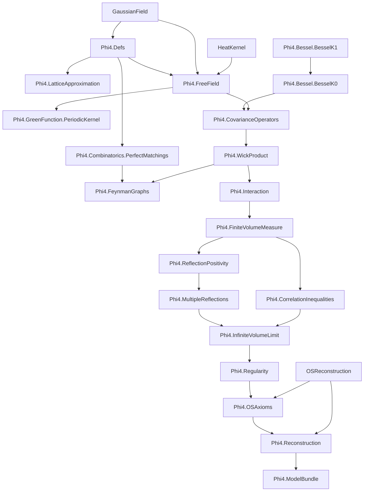

# Phi4: Formal Construction of the φ⁴₂ Quantum Field Theory

A Lean 4 formalization of constructive 2D φ⁴ Euclidean QFT, with the end goal:

1. prove Osterwalder-Schrader (OS) axioms for the infinite-volume theory, and
2. obtain the corresponding Wightman QFT.

Primary reference: Glimm-Jaffe, *Quantum Physics: A Functional Integral Point of View* (2nd ed.).

## Canonical Goal And Architecture (Authoritative)

All local development and documentation in this repository is organized around one target:

1. formalize the Glimm-Jaffe construction of 2D `φ⁴` in infinite volume,
2. prove OS axioms (OS0-OS4, with explicit weak-coupling handling for OS4),
3. reconstruct the corresponding Wightman theory.

Architecture is interpreted in this order:

1. finite-volume construction and estimates,
2. infinite-volume limit and moment/measure bridges,
3. OS packaging and weak-coupling cluster input,
4. reconstruction to Wightman.

`...Model` interfaces are explicit proof-debt boundaries for this pipeline. Any
upstream `OSReconstruction` blocker triage is secondary support work, not the
project objective.

## Status Snapshot (2026-02-27)

- Core modules (`Phi4/**/*.lean`, excluding `Phi4/Scratch`):
  - theorem-level `sorry` count: `0`,
  - `axiom` declarations: `0`,
  - `def`/`abbrev`-level `sorry`: `0`.
- Scratch modules (`Phi4/Scratch/**/*.lean`) theorem-level `sorry` count: `0`.
- Build status: `lake build Phi4` succeeds.
- Trust audit script checks:
  - no explicit axioms,
  - no `def/abbrev := by sorry`,
  - selected trusted interface/bundle endpoints are free of `sorryAx`.
- Open frontier obligations are represented explicitly as theorem-level `gap_*`
  endpoints and interface assumptions (`...Model` classes), not hidden in
  definitions.
- Upstream OS-to-Wightman adapter risk is isolated in
  `Phi4/ReconstructionUpstream.lean`; core reconstruction remains
  backend-abstract via `WightmanReconstructionModel`.

### Recent Infrastructure Progress

- `Phi4/FeynmanGraphs/LocalizedBounds.lean` now includes weighted occupancy
  inequalities, including graph-specialized bounds:
  `∏ (N! * A^N) ≤ (∑ N)! * A^(∑ N)`.
- `Phi4/FeynmanGraphs/LocalizedBounds.lean` now also includes generic
  degree-capped weighted-to-vertex-exponential bridges:
  `graphIntegral_abs_le_const_pow_vertices_of_degree_weighted_bound` and
  `feynman_expansion_abs_le_uniform_const_pow_vertices_of_degree_weighted_family`
  (the latter adds graph-count growth control `#graphs ≤ N^{|V|}`).
- `Phi4/Interaction.lean` now includes reusable bridges from lower bounds to
  Boltzmann-weight integrability:
  - `memLp_exp_neg_of_ae_lower_bound`,
  - cutoff-sequence transfer lemmas (all-`n` and eventually-`n`),
  - Borel-Cantelli tail bridges from summable cutoff bad-event sets to
    eventual almost-sure lower bounds, plus variants using summable
    bad-event majorants `μ(badₙ) ≤ εₙ` and geometric tails
    `μ(badₙ) ≤ C rⁿ` (`r < 1`), including exponential-tail specializations
    `μ(badₙ) ≤ C * exp(-α n)` (`α > 0`),
  - constructor paths to instantiate
    `InteractionWeightModel`/`InteractionIntegrabilityModel` from cutoff lower
    bound data.
- `Phi4/Reconstruction.lean` now includes direct WP1-style-to-reconstruction
  bridge endpoints using shifted-cutoff geometric moment assumptions, including:
  `gap_phi4_linear_growth_of_uv_cutoff_seq_shifted_exponential_moment_geometric_bound`,
  `reconstructionLinearGrowthModel_nonempty_of_uv_cutoff_seq_shifted_exponential_moment_geometric_bound`,
  and
  `phi4_wightman_exists_of_interfaces_of_uv_cutoff_seq_shifted_exponential_moment_geometric_bound`.
- `Phi4/Regularity.lean` now includes concrete constructor chains from explicit
  Wick/EOM/exhaustion/global-bound data to regularity interfaces, including
  `uniformGeneratingFunctionalBoundModel_nonempty_of_global_uniform`,
  `nonlocalPhi4BoundModel_nonempty_of_global_uniform`, and
  `regularityModel_nonempty_of_wick_eom_exhaustion_limit_global_uniform`.
- `Phi4/FreeField.lean`, `Phi4/CovarianceOperators.lean`, and
  `Phi4/CorrelationInequalities.lean` include `*_nonempty_of_data` constructors
  so constructive proof data can be attached to interfaces without ad hoc
  instance boilerplate.
- `Phi4/CorrelationInequalities.lean` now also includes all-arity monotonicity
  family interfaces and lattice-family bridge interfaces:
  `SchwingerNMonotoneFamilyModel` and
  `LatticeSchwingerNMonotoneFamilyModel`, with compatibility instances from
  family-level assumptions to fixed-arity `k` assumptions.
- `Phi4/InfiniteVolumeLimit.lean` now includes all-arity existence endpoints
  driven by these family assumptions:
  `infinite_volume_schwinger_exists_all_k_of_family_models` and
  `infinite_volume_schwinger_exists_all_k_of_lattice_family_models`.
- `CorrelationFourPointModel` now explicitly carries
  `schwinger_four_monotone`; this induces
  `SchwingerNMonotoneModel params 4` directly and supports dedicated
  `k = 4` infinite-volume endpoints:
  `infinite_volume_schwinger_exists_four_of_models` and
  `infinite_volume_schwinger_exists_four_of_lattice_models`.
- Lattice iSup-form two-point convergence endpoints in
  `Phi4/InfiniteVolumeLimit.lean` now use shifted exhaustion sequences
  `(n + 1)` and no longer depend on `LatticeGriffithsFirstModel`.
- `Phi4/FreeField.lean` now also includes
  `freeCovarianceKernelModel_nonempty_of_two_point_kernel`, a direct bridge
  from a free two-point kernel identity to `FreeCovarianceKernelModel`.
- `Phi4/FreeField.lean` now also exposes public reusable free-kernel
  analytic lemmas:
  `freeCovKernel_eq_besselK0`,
  `freeCovKernel_nonneg_offDiagonal`,
  `freeCovKernel_le_besselK1_offDiagonal`,
  `abs_freeCovKernel_le_besselK1_offDiagonal`.

### High-Level Architecture State

- Correlation assumptions are split into
  `CorrelationTwoPointModel` / `CorrelationFourPointModel` /
  `CorrelationFKGModel`, with compatibility reconstruction.
- Finite-volume `k`-point monotonicity assumptions are also split into fixed-
  arity and family-level interfaces
  (`SchwingerNMonotoneModel` / `SchwingerNMonotoneFamilyModel`), with lattice
  counterparts and compatibility reconstruction.
- Lattice interfaces are kept as optional bridge assumptions for proving
  continuum statements; continuum Schwinger/OS/reconstruction objects remain
  canonical.
- Boundary covariance assumptions are split into
  `BoundaryKernelModel` / `BoundaryComparisonModel` /
  `BoundaryRegularityModel`, with compatibility reconstruction.
- Infinite-volume assumptions are split into
  `InfiniteVolumeSchwingerModel` + `InfiniteVolumeMeasureModel`,
  reconstructing `InfiniteVolumeLimitModel`.
- Reconstruction assumptions are split into
  `ReconstructionLinearGrowthModel` + `ReconstructionWeakCouplingModel`,
  reconstructing `ReconstructionInputModel`.

## Project Objective

Formalize a mathematically sound pipeline for φ⁴₂:

1. finite-volume construction,
2. infinite-volume limit,
3. OS axiom verification,
4. reconstruction to Wightman theory.

## Comprehensive Lean Module Dependency Graph



## End-to-End Proof Flowchart (Mathematical)

```mermaid
flowchart LR
  A[Free Gaussian field dφ_C on S'(R²)] --> B[Wick ordering and φ⁴ interaction V_Λ]
  B --> C[Finite-volume measure dμ_Λ = Z_Λ^{-1} e^{-V_Λ} dφ_C]
  C --> D[Correlation inequalities: GKS/FKG/Lebowitz]
  C --> E[Reflection positivity in finite volume]
  E --> F[Multiple reflections / chessboard bounds]
  D --> G[Monotonicity in Λ]
  F --> H[Uniform bounds in Λ]
  G --> I[Infinite-volume Schwinger limit]
  H --> I
  I --> J[Regularity / generating-functional bounds (OS1)]
  I --> K[OS0/OS2/OS3 packaging]
  J --> K
  K --> L[OS axioms package]
  L --> M[Wightman reconstruction input]
```

## Assumption Interface Layer (Current)

Some high-complexity components are intentionally exposed as structured assumptions to keep downstream development rigorous and explicit:

- `BoundaryKernelModel`
- `BoundaryComparisonModel`
- `BoundaryRegularityModel`
- `InteractionIntegrabilityModel`
- `InteractionUVModel`
- `InteractionWeightModel`
- `FiniteVolumeComparisonModel`
- `CorrelationTwoPointModel`
- `CorrelationFourPointModel`
- `CorrelationFKGModel`
- `InfiniteVolumeSchwingerModel`
- `InfiniteVolumeMeasureModel`
- `FreeReflectionPositivityModel`
- `DirichletReflectionPositivityModel`
- `InteractingReflectionPositivityModel`
- `MultipleReflectionModel`
- `InfiniteVolumeLimitModel`
- `WickPowersModel`
- `RegularityModel`
- `OSAxiomCoreModel`
- `OSE4ClusterModel`
- `OSDistributionE2Model`
- `MeasureOS3Model`
- `ReconstructionLinearGrowthModel`
- `ReconstructionWeakCouplingModel`
- `ReconstructionInputModel`

Compatibility instances reconstruct:
- `CorrelationInequalityModel` from the three correlation submodels.
- `BoundaryCovarianceModel` from boundary kernel/comparison/regularity submodels.
- `InfiniteVolumeLimitModel` from Schwinger + measure submodels.
- `ReconstructionInputModel` from linear-growth + weak-coupling submodels.

`Phi4.ModelBundle` collects these interfaces into one bundled entrypoint.

## File Map (Purpose)

| File | Purpose |
|------|---------|
| `Phi4/Defs.lean` | Core types and geometric/setup data |
| `Phi4/LatticeApproximation.lean` | Rectangular lattice geometry, discretization, and Riemann-sum infrastructure |
| `Phi4/Combinatorics/PerfectMatchings.lean` | Perfect matching / pairing combinatorics for Wick expansions |
| `Phi4/GreenFunction/PeriodicKernel.lean` | Periodic method-of-images kernel shifts and truncated lattice sums |
| `Phi4/FreeField.lean` | Free Gaussian field and covariance CLM infrastructure |
| `Phi4/Bessel/BesselK1.lean` | Bessel K1 technical lemmas |
| `Phi4/Bessel/BesselK0.lean` | Bessel K0 definitions and bridge lemmas |
| `Phi4/CovarianceOperators.lean` | Covariance operators and comparison skeleton |
| `Phi4/WickProduct.lean` | Wick monomials and rewick identities |
| `Phi4/FeynmanGraphs.lean` | Graph-expansion interface layer |
| `Phi4/Interaction.lean` | Interaction and integrability interface |
| `Phi4/FiniteVolumeMeasure.lean` | Finite-volume measure and Schwinger moments |
| `Phi4/CorrelationInequalities.lean` | GKS/FKG/Lebowitz interfaces and derived bounds |
| `Phi4/ReflectionPositivity.lean` | Time reflection and RP interfaces |
| `Phi4/MultipleReflections.lean` | Chessboard and determinant-style bounds |
| `Phi4/InfiniteVolumeLimit.lean` | Exhaustion, monotonicity, infinite-volume model interface |
| `Phi4/Regularity.lean` | Regularity / OS1 interface |
| `Phi4/OSAxioms.lean` | OS axiom packaging for φ⁴₂ Schwinger functions |
| `Phi4/Reconstruction.lean` | Wightman existence via explicit reconstruction input |
| `Phi4/ModelBundle.lean` | Bundled model assumptions for end-to-end use |

## Build

Requires Lean `v4.28.0`.

```bash
lake build Phi4
```

## Trust / Audit Commands

`scripts/check_phi4_trust.sh` now includes a theorem-dependency guard for
trusted endpoints (`#print axioms` check, rejecting `sorryAx`).

```bash
scripts/check_phi4_trust.sh
rg -n "^[[:space:]]*axiom\\b" Phi4 --glob '*.lean'
grep -RIn "^[[:space:]]*sorry\\b" Phi4 --include='*.lean'
lake build Phi4
```

## Upstream Blocker Workflow

Systematic infrastructure for upstream `OSReconstruction` blocker closure:

```bash
# Recompute blocker inventory + ranked queues + status merge
scripts/upstream_blockers_scan.sh

# Recompute and sync TODO inventory block
scripts/sync_upstream_blockers_todo.sh

# Queue operations (list, claim-next, set, stats)
scripts/upstream_blockers_status.sh list open 20

# Generate declaration prompt and top-N workpack
scripts/upstream_blockers_prompt.sh "Wightman/Reconstruction/WickRotation/OSToWightman.lean" theorem full_analytic_continuation
scripts/upstream_blockers_workpack.sh 10 open
```

Outputs are written under `docs/upstream_blockers/generated/`, and persistent
declaration statuses are tracked in `docs/upstream_blockers/status.tsv`.

## Planning Docs

- `TODO.md` — active engineering queue and dependency-aware plan.
- `ProofIdeas/` — chapter-wise mathematical planning notes.

## References

- J. Glimm, A. Jaffe, *Quantum Physics: A Functional Integral Point of View*, 2nd ed.
- B. Simon, *The P(φ)₂ Euclidean (Quantum) Field Theory*
- V. Rivasseau, *From Perturbative to Constructive Renormalization*

## License

Apache 2.0
