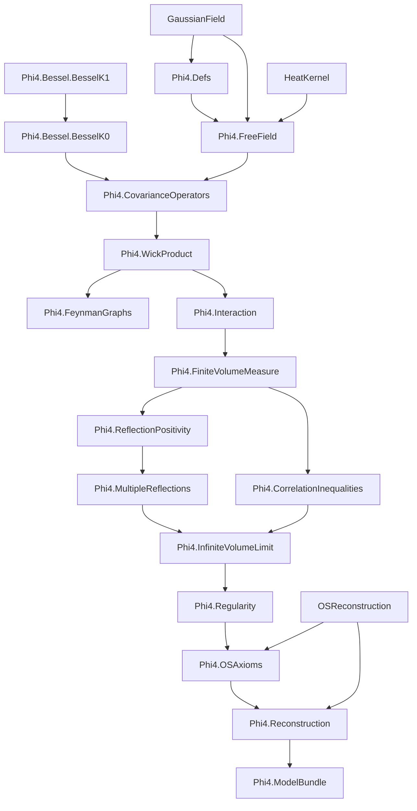

# Phi4: Formal Construction of the φ⁴₂ Quantum Field Theory

A Lean 4 formalization of constructive 2D φ⁴ Euclidean QFT, with the end goal:

1. prove Osterwalder-Schrader (OS) axioms for the infinite-volume theory, and
2. obtain the corresponding Wightman QFT.

Primary reference: Glimm-Jaffe, *Quantum Physics: A Functional Integral Point of View* (2nd ed.).

## Status Snapshot (2026-02-25)

- `Phi4/*.lean` `sorry` count: `0`.
- `Phi4/*.lean` `axiom` declarations: `0`.
- Build status: `lake build Phi4` succeeds.
- Several deep analytic/reconstruction steps are currently represented via explicit assumption interfaces (`...Model` classes), not placeholders.
- Upstream `OSReconstruction` currently emits `sorry` warnings in some modules; this project treats reconstruction as an explicit input assumption at the final handoff point.

## Project Objective

Formalize a mathematically sound pipeline for φ⁴₂:

1. finite-volume construction,
2. infinite-volume limit,
3. OS axiom verification,
4. reconstruction to Wightman theory.

## Comprehensive Lean Module Dependency Graph



## End-to-End Proof Flowchart (Mathematical)

```mermaid
flowchart LR
  A[Free Gaussian field dφ_C on S'(R²)] --> B[Wick ordering and φ⁴ interaction V_Λ]
  B --> C[Finite-volume measure dμ_Λ = Z_Λ^{-1} e^{-V_Λ} dφ_C]
  C --> D[Correlation inequalities: GKS/FKG/Lebowitz]
  C --> E[Reflection positivity in finite volume]
  E --> F[Multiple reflections / chessboard bounds]
  D --> G[Monotonicity in Λ]
  F --> H[Uniform bounds in Λ]
  G --> I[Infinite-volume Schwinger limit]
  H --> I
  I --> J[Regularity / generating-functional bounds (OS1)]
  I --> K[OS0/OS2/OS3 packaging]
  J --> K
  K --> L[OS axioms package]
  L --> M[Wightman reconstruction input]
```

## Assumption Interface Layer (Current)

Some high-complexity components are intentionally exposed as structured assumptions to keep downstream development rigorous and explicit:

- `InteractionIntegrabilityModel`
- `FiniteVolumeComparisonModel`
- `CorrelationInequalityModel`
- `FreeReflectionPositivityModel`
- `DirichletReflectionPositivityModel`
- `InteractingReflectionPositivityModel`
- `MultipleReflectionModel`
- `InfiniteVolumeLimitModel`
- `WickPowersModel`
- `RegularityModel`
- `OSAxiomModel`
- `ReconstructionInputModel`

`Phi4.ModelBundle` collects these interfaces into one bundled entrypoint.

## File Map (Purpose)

| File | Purpose |
|------|---------|
| `Phi4/Defs.lean` | Core types and geometric/setup data |
| `Phi4/FreeField.lean` | Free Gaussian field and covariance CLM infrastructure |
| `Phi4/Bessel/BesselK1.lean` | Bessel K1 technical lemmas |
| `Phi4/Bessel/BesselK0.lean` | Bessel K0 definitions and bridge lemmas |
| `Phi4/CovarianceOperators.lean` | Covariance operators and comparison skeleton |
| `Phi4/WickProduct.lean` | Wick monomials and rewick identities |
| `Phi4/FeynmanGraphs.lean` | Graph-expansion interface layer |
| `Phi4/Interaction.lean` | Interaction and integrability interface |
| `Phi4/FiniteVolumeMeasure.lean` | Finite-volume measure and Schwinger moments |
| `Phi4/CorrelationInequalities.lean` | GKS/FKG/Lebowitz interfaces and derived bounds |
| `Phi4/ReflectionPositivity.lean` | Time reflection and RP interfaces |
| `Phi4/MultipleReflections.lean` | Chessboard and determinant-style bounds |
| `Phi4/InfiniteVolumeLimit.lean` | Exhaustion, monotonicity, infinite-volume model interface |
| `Phi4/Regularity.lean` | Regularity / OS1 interface |
| `Phi4/OSAxioms.lean` | OS axiom packaging for φ⁴₂ Schwinger functions |
| `Phi4/Reconstruction.lean` | Wightman existence via explicit reconstruction input |
| `Phi4/ModelBundle.lean` | Bundled model assumptions for end-to-end use |

## Build

Requires Lean `v4.28.0`.

```bash
lake build Phi4
```

## Trust / Audit Commands

```bash
rg -n "\\bsorry\\b|\\bsorryAx\\b|^axiom" Phi4 --glob '*.lean'
lake build Phi4
```

## Planning Docs

- `TODO.md` — active engineering queue and dependency-aware plan.
- `ProofIdeas/` — chapter-wise mathematical planning notes.

## References

- J. Glimm, A. Jaffe, *Quantum Physics: A Functional Integral Point of View*, 2nd ed.
- B. Simon, *The P(φ)₂ Euclidean (Quantum) Field Theory*
- V. Rivasseau, *From Perturbative to Constructive Renormalization*

## License

Apache 2.0
