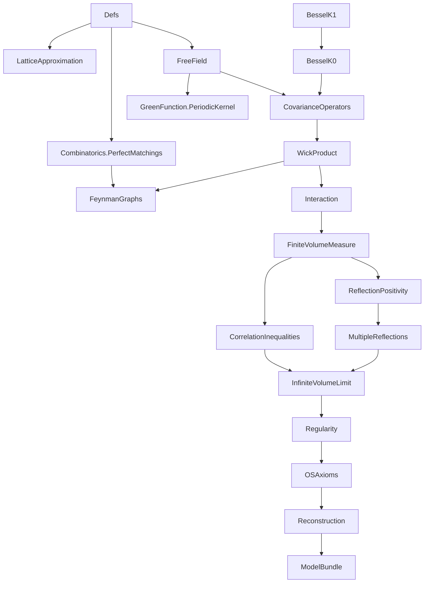
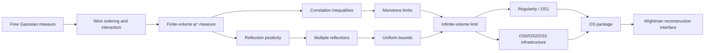
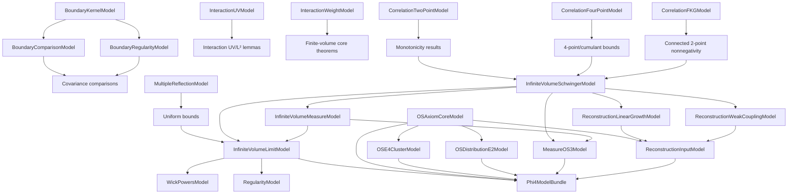

# TODO: 2D φ⁴ Project Development Plan

## Canonical Goal And Architecture (Authoritative)

The primary goal is the Glimm-Jaffe `φ⁴₂` pipeline:

1. construct infinite-volume Schwinger functions,
2. establish OS axioms (OS0-OS4, with explicit weak-coupling control for OS4),
3. reconstruct Wightman functions from the OS package.

All work packages and checklists in this file are interpreted in that order.
`...Model` classes represent explicit proof obligations in this pipeline.
Upstream blocker inventories are supporting context only and must not override
the local Glimm-Jaffe objective.

## Status Snapshot (2026-02-27)

- Core modules (`Phi4/**/*.lean`, excluding `Phi4/Scratch`) have `0` theorem-level `sorry` (intentional honest frontiers remain as theorem-level gaps via `gap_*` endpoints).
- Scratch modules (`Phi4/Scratch/**/*.lean`) have `0` theorem-level `sorry`.
- `Phi4/**/*.lean` has `0` `axiom` declarations.
- `Phi4/**/*.lean` has `0` `def/abbrev := by sorry`.
- `lake build Phi4` succeeds.
- `scripts/check_phi4_trust.sh` now also enforces that selected trusted
  interface/bundle endpoints are free of `sorryAx` dependencies (`#print axioms` check).
- Upstream blocker triage is now automated via
  `scripts/upstream_blockers_scan.sh` (inventory + file/declaration queues +
  status merge), `scripts/sync_upstream_blockers_todo.sh` (TODO sync), and
  `scripts/upstream_blockers_status.sh` (queue status operations); declaration
  prompt/workpack generation is available via
  `scripts/upstream_blockers_prompt.sh` and
  `scripts/upstream_blockers_workpack.sh`.
- Upstream OS→Wightman bridge is isolated in `Phi4/ReconstructionUpstream.lean`;
  core reconstruction remains backend-abstract (`WightmanReconstructionModel`).
- New WP1 infrastructure module `Phi4/FeynmanGraphs/LocalizedBounds.lean` adds
  reusable factorial occupancy bounds for localized graph estimates.
- `Phi4/FeynmanGraphs/LocalizedBounds.lean` now also provides weighted occupancy
  inequalities (`∏ (N! * A^N) ≤ (∑ N)! * A^(∑ N)`) and graph-specialized forms
  for vertex leg counts.
- `Phi4/Interaction.lean` now provides a reusable measure-theoretic bridge
  `memLp_exp_neg_of_ae_lower_bound` (and the interaction specialization
  `exp_interaction_Lp_of_ae_lower_bound`) for the Chapter 8 route from
  semiboundedness/tail bounds to `exp(-V_Λ) ∈ Lᵖ`.
- `Phi4/Interaction.lean` now also provides cutoff-sequence lower-bound transfer
  lemmas and direct constructors
  (`interactionWeightModel_nonempty_of_cutoff_seq_lower_bounds`,
  `interactionIntegrabilityModel_nonempty_of_uv_cutoff_seq_lower_bounds`)
  so constructive cutoff bounds can instantiate the Chapter 8 interfaces directly.
- `Phi4/Interaction.lean` now additionally supports eventually-in-cutoff (`∀ᶠ n`)
  AE lower-bound transfer and matching constructors
  (`interactionWeightModel_nonempty_of_cutoff_seq_eventually_lower_bounds`,
  `interactionIntegrabilityModel_nonempty_of_uv_cutoff_seq_eventually_lower_bounds`),
  reducing the need for all-`n` lower-bound assumptions.
- `Phi4/Interaction.lean` now also supports variable per-cutoff constants
  (`Bₙ`) with eventual uniform control (`Bₙ ≤ B` eventually) via
  `exp_interaction_Lp_of_cutoff_seq_variable_lower_bounds` and matching
  weight/integrability constructors.
- `Phi4/Interaction.lean` now also supports Borel-Cantelli transfer from
  summable cutoff bad-event tails to eventual almost-sure cutoff lower bounds,
  with corresponding `exp_interaction_Lp` and weight/integrability constructors;
  and now includes majorant variants using explicit summable envelopes
  (`μ badₙ ≤ εₙ`, `∑ εₙ < ∞`) plus geometric-tail specializations
  (`μ badₙ ≤ C rⁿ`, `r < 1`) and exponential-tail specializations
  (`μ badₙ ≤ C * exp(-α n)`, `α > 0`).
- `docs/CLAUDE_TO_CODEX_TRACKER.md` now tracks systematic remediation of
  issues raised in `claude_to_codex.md`.
- `Phi4/LatticeApproximation.lean` now provides rectangular mesh geometry,
  discretization maps, Riemann-sum identities, and monotonicity lemmas.
- `Phi4/Combinatorics/PerfectMatchings.lean` now centralizes pairing/perfect-matching
  combinatorics for Wick/Feynman expansion infrastructure.
- `PairingEnumerationModel` now records only cardinality of pairings; enumeration
  itself is canonical via `Finset.univ`.
- `Phi4/CovarianceOperators.lean` now exposes boundary-covariance subinterfaces
  (`BoundaryKernelModel`, `BoundaryComparisonModel`, `BoundaryRegularityModel`)
  plus derived quadratic comparison lemmas (`C_D ≤ C ≤ C_N` consequences).
- `Phi4/FreeField.lean` now includes a direct model-construction bridge from
  two-point kernel identities:
  `freeCovarianceKernelModel_nonempty_of_two_point_kernel`.
- `Phi4/FreeField.lean` now exports reusable free-kernel Bessel
  representation/off-diagonal bounds (`freeCovKernel_eq_besselK0` and
  `K₁`-comparison consequences) for downstream covariance estimates.
- `Phi4/ReflectionPositivity.lean` now requires only boundary-kernel data for
  Dirichlet RP assumptions (`BoundaryKernelModel`), consistent with the covariance split.
- `Phi4/ModelBundle.lean` now carries boundary kernel/comparison/regularity
  submodels directly; full boundary covariance is reconstructed by instance.
- `Phi4/GreenFunction/PeriodicKernel.lean` now provides concrete periodic
  image-shift and truncated lattice-sum kernel infrastructure.
- `Phi4/CorrelationInequalities.lean` now includes lattice-to-continuum
  bridge interfaces/theorems for GKS-I and 2-point monotonicity transfer,
  and now exposes correlation subinterfaces
  (`CorrelationTwoPointModel`, `CorrelationFourPointModel`, `CorrelationFKGModel`).
- Constructor scaffolds were added for explicit interface instantiation in
  `FreeField.lean`, `CovarianceOperators.lean`, and `CorrelationInequalities.lean`
  (`*_nonempty_of_data` theorems), so WP2/WP3 proof data can be ported into
  stable class instances without ad hoc wrapper code.
- `Phi4/CorrelationInequalities.lean` now also provides core constructor bridges
  that source 4-point monotonicity from monotone-moment interfaces:
  `correlationInequalityCoreModel_nonempty_of_data_and_schwingerFourMonotone`
  and the lattice-specialized
  `correlationInequalityCoreModel_nonempty_of_data_and_lattice_monotone`.
- `Phi4/InfiniteVolumeLimit.lean` and `Phi4/Reconstruction.lean` now use
  minimal correlation assumptions by theorem block (two-point/four-point/FKG).
- `Phi4/InfiniteVolumeLimit.lean` now exposes
  `InfiniteVolumeSchwingerModel` + `InfiniteVolumeMeasureModel`, with
  `InfiniteVolumeLimitModel` reconstructed by compatibility instance.
- Infinite-volume inequality/convergence theorem blocks in
  `Phi4/InfiniteVolumeLimit.lean` and wrappers in `Phi4/Reconstruction.lean`
  now use `InfiniteVolumeSchwingerModel` where measure representation is unused.
- `Phi4/InfiniteVolumeLimit.lean` now provides constructive two-point
  exhaustion lemmas sourced from `MultipleReflectionModel`:
  `schwingerTwo_uniformly_bounded_on_exhaustion`,
  `schwingerTwo_tendsto_iSup_of_models`,
  `schwingerTwo_limit_exists_of_models`,
  with lattice and `schwingerN` (`k = 2`) model-driven variants, plus
  interface-shaped `if h : 0 < n then ... else 0` convergence/existence
  theorems in the two-point channel (including
  `infinite_volume_schwinger_exists_two_of_models` and
  `infinite_volume_schwinger_exists_two_of_lattice_models`).
- `Phi4/InfiniteVolumeLimit.lean` now has a reusable permutation-transfer
  lemma `infiniteVolumeSchwinger_perm`, with
  `infiniteVolumeSchwinger_two_symm` now proved from it.
- `Phi4/InfiniteVolumeLimit.lean` now has reusable infinite-volume connected
  two-point linearity/bilinearity infrastructure:
  `connectedTwoPoint_add_left`, `connectedTwoPoint_smul_left`,
  `connectedTwoPoint_add_right`, `connectedTwoPoint_smul_right`,
  `connectedTwoPointBilinear`, `connectedTwoPointBilinear_symm`,
  `connectedTwoPointBilinear_self_nonneg`; and
  `connectedTwoPoint_quadratic_nonneg` now uses this bilinear route.
- `Phi4/CorrelationInequalities.lean` now includes generic finite-volume
  `k`-point monotonicity infrastructure `SchwingerNMonotoneModel` (with
  `k = 2` instance from `CorrelationTwoPointModel` and lattice constructor),
  plus family-level interfaces
  `SchwingerNMonotoneFamilyModel` / `LatticeSchwingerNMonotoneFamilyModel`
  with compatibility bridges from family assumptions to fixed-arity interfaces;
  `CorrelationFourPointModel` now also carries explicit 4-point volume
  monotonicity (`schwinger_four_monotone`), inducing
  `SchwingerNMonotoneModel params 4`.
- `Phi4/InfiniteVolumeLimit.lean` now includes generic `k`-point monotone
  convergence/existence infrastructure:
  `schwingerN_monotone_in_volume_of_model`,
  `schwingerN_tendsto_iSup_of_models`,
  `schwingerN_limit_exists_of_models`,
  `schwingerN_limit_exists_if_exhaustion_of_models`,
  `infinite_volume_schwinger_exists_k_of_models`,
  `infinite_volume_schwinger_exists_all_k_of_family_models`,
  `infinite_volume_schwinger_exists_all_k_of_lattice_family_models`,
  `infinite_volume_schwinger_exists_four_of_models`,
  `infinite_volume_schwinger_exists_four_of_lattice_models`,
  and routes two-point endpoints through these generic theorems.
- In `Phi4/InfiniteVolumeLimit.lean`, lattice iSup-form two-point convergence
  theorems now use shifted exhaustion sequences `(n + 1)` and no longer require
  `LatticeGriffithsFirstModel`
  (`schwingerTwo_tendsto_if_exhaustion_of_lattice_models`,
   `schwingerN_two_tendsto_if_exhaustion_of_lattice_models`).
- `Phi4/ModelBundle.lean` now carries infinite-volume Schwinger/measure/moment
  submodels directly and reconstructs `InfiniteVolumeLimitModel` by instance.
- `Phi4/OSAxioms.lean` now places `MeasureOS3Model` on the weaker
  measure-only assumptions, and `phi4_os3` follows this reduced interface.
- `OSAxiomCoreModel`, `OSE4ClusterModel`, and `OSDistributionE2Model` are now
  decoupled from `InfiniteVolumeLimitModel`; `phi4_satisfies_OS` now depends on
  the OS-package interfaces directly rather than a separate IV-limit hypothesis.
- `Phi4/Reconstruction.lean` now places
  `ConnectedTwoPointDecayAtParams`, `UniformWeakCouplingDecayModel`,
  `ReconstructionInputModel`, and `WightmanReconstructionModel` on
  `InfiniteVolumeSchwingerModel` rather than `InfiniteVolumeLimitModel`.
- `ConnectedTwoPointDecayAtParams` now uses a physically sound statement:
  uniform positive mass gap with test-function-pair-dependent amplitudes,
  avoiding an over-strong single global amplitude constant.
- `ReconstructionInputModel` is now split into
  `ReconstructionLinearGrowthModel` + `ReconstructionWeakCouplingModel`,
  with compatibility reconstruction kept for existing APIs.
- `ReconstructionLinearGrowthModel` is now decoupled from
  `InfiniteVolumeSchwingerModel`; linear-growth/Wightman interface endpoints now
  depend only on OS-package + E0' data where Schwinger-limit inputs are not used.
- `phi4_satisfies_OS` and fixed-parameter Wightman interface corollaries were
  further trimmed to remove unused `InfiniteVolumeSchwingerModel` assumptions in
  their signatures, tightening the non-smuggled dependency surface.
- `InfiniteVolumeMeasureModel` now carries only measure/probability data, with
  Schwinger moment representation split into `InfiniteVolumeMomentModel`; the
  `InfiniteVolumeLimitModel` reconstruction instance now requires this explicit
  moment bridge instead of bundling it into the measure interface.
- `MeasureOS3Model` is now explicitly measure-level (depends only on
  `InfiniteVolumeMeasureModel`), removing an unnecessary Schwinger-package
  dependency from OS3 reflection-positivity assumptions.
- `WickPowersModel` and `RegularityModel` now depend only on
  `InfiniteVolumeMeasureModel` (rather than `InfiniteVolumeLimitModel`),
  reducing model-surface coupling and avoiding assumption smuggling through the
  larger package.
- `ReconstructionWeakCouplingModel` is now derivable from
  `UniformWeakCouplingDecayModel` via
  `reconstructionWeakCouplingModel_of_uniform`, reducing duplicated
  fixed-parameter weak-coupling assumptions when uniform decay data is available.
- `Phi4/ModelBundle.lean` now stores reconstruction linear-growth and
  global weak-coupling decay inputs directly; fixed-parameter weak-coupling
  thresholds are reconstructed by instance.
- `Reconstruction.lean` now provides
  `phi4_wightman_exists_of_interfaces` as a trusted interface-level
  endpoint, and `Phi4/ModelBundle.lean` now uses this theorem in
  `phi4_wightman_exists_of_bundle` (bypassing frontier-gap wrappers).
- `Reconstruction.lean` now includes trusted interface-level downstream
  corollaries (`phi4_selfadjoint_fields_of_interfaces`,
  `phi4_locality_of_interfaces`, `phi4_lorentz_covariance_of_interfaces`,
  `phi4_unique_vacuum_of_interfaces`) with matching bundle wrappers.
- `Reconstruction.lean` now includes an `ε`-`R` clustering consequence of
  connected two-point exponential decay
  (`connectedTwoPoint_decay_eventually_small`) and its weak-coupling-threshold
  specialization
  (`phi4_connectedTwoPoint_decay_below_threshold_eventually_small`), plus an
  explicit-Schwinger `ε`-`R` variant
  (`phi4_connectedTwoPoint_decay_below_threshold_eventually_small_explicit`),
  with bundled wrappers in `ModelBundle.lean`.
- `Reconstruction.lean` now also includes global weak-coupling `ε`-`R`
  clustering theorems
  (`phi4_os4_weak_coupling_eventually_small`,
  `phi4_os4_weak_coupling_eventually_small_explicit`) from
  `UniformWeakCouplingDecayModel`, with bundled wrappers.
- `ModelBundle.lean` now exposes bundled wrappers for both base global OS4
  weak-coupling decay forms and their `ε`-`R` variants.
- `translateTestFun` is now a public `Reconstruction.lean` helper so bundled
  theorem signatures can state translated-test-function clustering directly.
- `OSAxioms.lean` now includes trusted OS1 theorem
  `phi4_os1_of_interface`; `ModelBundle.lean` now exposes `phi4_os1_of_bundle`.
- `Phi4/ModelBundle.lean` now carries correlation submodels directly; full
  `CorrelationInequalityModel` is reconstructed by instance.
- `Phi4/HonestGaps.lean` now forwards to canonical core frontiers and contains no local `sorry`.
- FKG-derived connected two-point nonnegativity statements now explicitly
  require nonnegative test functions (corrected soundness of statement direction).
- Remaining gap to final theorem is not placeholder closure; it is replacement of high-level assumption interfaces with internal constructive proofs.

## Development Rules (Authoritative)

1. No `axiom` declarations in `Phi4`.
2. No fake placeholders or vacuous theorem statements.
3. Keep statements mathematically sound and aligned with Glimm-Jaffe.
4. Prefer proving reusable intermediate lemmas over one-off theorem hacks.

## Comprehensive Dependency / Flowchart

### A. Lean Module DAG



### B. Mathematical Proof Flow



### C. Interface-Dependency Layer (Current Architecture)



## Work Packages (Priority Order)

## WP1: Interaction Integrability Closure

Goal: replace `InteractionIntegrabilityModel` assumptions by internal proofs of the key Chapter 8 integrability statements.

Deliverables:
- prove `exp_interaction_Lp` from semibounded Wick-4 + tail control,
- derive `partition_function_pos` and `partition_function_integrable` internally,
- minimize assumptions required by `finiteVolumeMeasure_isProbability`.

Exit criteria:
- `FiniteVolumeMeasure` probability and integrability theorems no longer depend on external interaction integrability assumptions.

## WP2: Correlation + Reflection Positivity Grounding

Goal: tighten the analytic source of inequalities and positivity, reducing purely abstract interfaces.

Deliverables:
- channel-precise GKS/Lebowitz inequalities (in progress; core derived channel bounds already added),
- bridge finite-volume positivity statements to OS-style positivity forms,
- remove redundant assumptions between RP layer and OS layer where derivable.

Exit criteria:
- explicit proof path from finite-volume correlation/RP statements to the OS positivity inputs used downstream.

## WP3: Infinite-Volume Construction Upgrade

Goal: reduce `InfiniteVolumeLimitModel` by proving concrete convergence/representation steps.

Progress:
- split completed: `InfiniteVolumeSchwingerModel` and `InfiniteVolumeMeasureModel`
  now isolate convergence/bounds from measure representation.
- two-point exhaustion convergence now has a constructive route where the
  absolute bound is derived internally from `MultipleReflectionModel` rather
  than passed as a separate theorem argument (both `schwingerTwo` and
  `schwingerN` for `k = 2`, including lattice-bridge variants and
  interface-style `if h : 0 < n` sequence endpoints).

Deliverables:
- strengthen monotonicity beyond the currently packaged 2-point channel,
- construct limit functionals with explicit convergence lemmas,
- prove moment representation with fewer abstract assumptions.

Exit criteria:
- at least one major field in `InfiniteVolumeLimitModel` moved from assumption to theorem.

## WP4: Regularity (OS1) Internalization

Goal: move from `RegularityModel` assumptions to proved generating-functional bounds.

Deliverables:
- formal Schwinger-Dyson / integration-by-parts chain,
- nonlocal bounds and uniform control,
- final `generating_functional_bound` theorem from project-internal lemmas.

Exit criteria:
- `phi4_os1` depends only on proven internal lemmas + clearly audited upstream results.

## WP5: OS/Reconstruction Hardening

Goal: keep final reconstruction stage sound despite upstream churn.

Deliverables:
- maintain `OSAxiomCoreModel`/`OSE4ClusterModel`/`OSDistributionE2Model`
  with minimal, non-redundant assumptions,
- keep `ReconstructionInputModel` explicit until upstream no-sorry reconstruction theorem is auditable,
- centralize handoff through `Phi4ModelBundle`.

Exit criteria:
- clean, auditable final theorem interface showing exact remaining assumptions.

## Phased Development Plan (2026-02-26)

### Model Classes to Replace (Dependency Order)

```
Level 0: BoundaryCovarianceModel, PairingEnumerationModel
Level 1: GaussianWickExpansionModel, FreeRP, DirichletRP
Level 2: FeynmanGraphEstimateModel, InteractionUV, InteractionWeight,
         CorrelationTwoPoint, CorrelationFourPoint, CorrelationFKG, InteractingRP
Level 3: FiniteVolumeComparison, MultipleReflectionModel
Level 4: InfiniteVolumeLimitModel
Level 5: WickPowersModel, RegularityModel
Level 6: OSAxiomCoreModel (now IV-limit independent), OSE4ClusterModel,
         OSDistributionE2Model, MeasureOS3Model
Level 7: ReconstructionLinearGrowthModel, ReconstructionWeakCouplingModel, ReconstructionInputModel
```

### Phase 0: Infrastructure Foundation
- [x] **0A** (Codex): Combinatorial pairings — `Phi4/Combinatorics/PerfectMatchings.lean`
- [ ] **0B** (Claude): Boundary covariance kernels — `Phi4/GreenFunction/{Dirichlet,Neumann,Periodic}Kernel.lean`
- [x] **0C** (Codex): Lattice approximation framework — `Phi4/LatticeApproximation.lean`

### Phase 1: Gaussian Estimates & Correlation Inequalities
- [ ] **1A** (Claude): Wick expansion + graph bounds → instantiate `GaussianWickExpansionModel`, `FeynmanGraphEstimateModel`
- [ ] **1B** (Codex+Claude): Correlation inequalities via lattice/core →
      instantiate `CorrelationTwoPointModel` + `CorrelationFourPointModel` +
      `CorrelationFKGModel` (and hence `CorrelationInequalityModel`)
- [ ] **1C** (Claude): `exp_interaction_Lp` (GJ 8.6.2) → instantiate `InteractionIntegrabilityModel`

### Phase 2: Reflection Positivity & Multiple Reflections
- [ ] **2A** (Claude): Free covariance RP (Fourier space)
- [ ] **2B** (Claude): Dirichlet + interacting RP (GJ 10.4)
- [ ] **2C** (Claude): Chessboard estimate (GJ 10.5.5) + uniform bound (GJ 11.3.1) — **hardest**
- [ ] **2D** (Claude): Finite volume comparison from Lebowitz

### Phase 3: Infinite Volume Construction
- [ ] **3A** (Claude): Schwinger convergence (monotone bounded → convergent)
- [ ] **3B** (Claude): Measure construction (Bochner-Minlos or Riesz-Markov)
- [ ] **3C** (Codex): Monotonicity extension beyond k=2
      generic deep infrastructure is now in place
      (`SchwingerNMonotoneModel`,
      `SchwingerNMonotoneFamilyModel`,
      `LatticeSchwingerNMonotoneFamilyModel`,
      and all-arity existence endpoints); remaining work is concrete
      `k > 2` monotonicity proofs/instances.

### Phase 4: Regularity & OS Axioms
- [ ] **4A** (Claude): Wick powers in infinite volume (GJ 12.2.1)
- [ ] **4B** (Claude): Schwinger-Dyson equation (GJ 12.2.3)
- [ ] **4C** (Claude): Generating functional bound (GJ 12.5.1) — **most analytically demanding**
- [ ] **4D** (Codex+Claude): OS axiom packaging (OS0-OS3)

### Phase 5: Cluster Expansion & Reconstruction
- [ ] **5A** (Claude+Codex): Cluster expansion infrastructure
- [ ] **5B** (Claude): OS4 for weak coupling
- [ ] **5C** (Claude): Linear growth condition bridge
- [ ] **5D** (Codex): Wightman reconstruction bridging

### Agent Coordination
- **Claude Code**: proof-heavy tasks (PDE, analysis, MCP-assisted interactive proving)
- **Codex**: structural code generation (combinatorics, lattice framework, API packaging)

## Immediate Next Queue

1. Complete Phase 0B (Claude: boundary covariance).
2. Continue Phase 1B (Codex+Claude): instantiate lattice/core bridge models
   to discharge correlation submodel fields constructively.

## Upstream Blocking Proof Inventory (auto-generated)

This section is a dependency-risk dashboard only. It is not the primary work
queue; the primary queue remains the local Glimm-Jaffe `φ⁴₂` OS pipeline above.

<!-- BEGIN_UPSTREAM_BLOCKERS -->
_Generated: 2026-02-27_

Generated from `.lake/packages/OSReconstruction/OSReconstruction/**/*.lean` by mapping each `sorry` token to its enclosing declaration.

- Total `sorry` tokens: `97`.
- Unique blocking declarations: `78` across `18` files.
- Queue status counts: `open=78`, `in_progress=0`, `blocked=0`, `done=0`.
- Entries marked `(xN)` contain multiple `sorry` tokens in one declaration.

Top file priorities (score/reverse-importers/declarations/tokens):
- `Wightman/WightmanAxioms.lean`: `284 / 5 / 2 / 4`
- `ComplexLieGroups/Connectedness.lean`: `217 / 4 / 1 / 2`
- `Wightman/Reconstruction/WickRotation/OSToWightman.lean`: `199 / 1 / 13 / 14`
- `vNA/ModularAutomorphism.lean`: `173 / 2 / 6 / 8`
- `SCV/LaplaceSchwartz.lean`: `166 / 2 / 6 / 6`
- `vNA/ModularTheory.lean`: `166 / 2 / 6 / 6`
- `vNA/KMS.lean`: `145 / 1 / 8 / 10`
- `ComplexLieGroups/GeodesicConvexity.lean`: `128 / 2 / 2 / 3`
- `SCV/BochnerTubeTheorem.lean`: `122 / 2 / 2 / 2`
- `SCV/PaleyWiener.lean`: `116 / 1 / 6 / 6`

### `ComplexLieGroups/Connectedness.lean` (priority `217`, reverse importers `4`, declarations `1`, sorry tokens `2`)
- `theorem:Fin.Perm.adjSwap_induction_right` (x2)

### `ComplexLieGroups/GeodesicConvexity.lean` (priority `128`, reverse importers `2`, declarations `2`, sorry tokens `3`)
- `theorem:geodesic_convexity_forwardCone` (x2)
- `theorem:polar_decomposition`

### `SCV/BochnerTubeTheorem.lean` (priority `122`, reverse importers `2`, declarations `2`, sorry tokens `2`)
- `theorem:bochner_local_extension`
- `theorem:holomorphic_extension_from_local`

### `SCV/LaplaceSchwartz.lean` (priority `166`, reverse importers `2`, declarations `6`, sorry tokens `6`)
- `theorem:fourierLaplace_boundary_continuous`
- `theorem:fourierLaplace_boundary_integral_convergence`
- `theorem:fourierLaplace_continuousWithinAt`
- `theorem:fourierLaplace_polynomial_growth`
- `theorem:fourierLaplace_uniform_bound_near_boundary`
- `theorem:polynomial_growth_of_continuous_bv`

### `SCV/PaleyWiener.lean` (priority `116`, reverse importers `1`, declarations `6`, sorry tokens `6`)
- `theorem:paley_wiener_cone`
- `theorem:paley_wiener_converse`
- `theorem:paley_wiener_half_line`
- `theorem:paley_wiener_one_step`
- `theorem:paley_wiener_one_step_simple`
- `theorem:paley_wiener_unique`

### `Wightman/NuclearSpaces/BochnerMinlos.lean` (priority `72`, reverse importers `1`, declarations `2`, sorry tokens `2`)
- `theorem:bochner_theorem`
- `theorem:bochner_uniqueness`

### `Wightman/Reconstruction/GNSHilbertSpace.lean` (priority `68`, reverse importers `1`, declarations `1`, sorry tokens `3`)
- `theorem:gnsFieldOp_domain` (x3)

### `Wightman/Reconstruction/Main.lean` (priority `111`, reverse importers `2`, declarations `1`, sorry tokens `1`)
- `theorem:wightman_uniqueness`

### `Wightman/Reconstruction/WickRotation/BHWExtension.lean` (priority `72`, reverse importers `1`, declarations `2`, sorry tokens `2`)
- `theorem:W_analytic_swap_distributional_agree`
- `theorem:analytic_boundary_local_commutativity`

### `Wightman/Reconstruction/WickRotation/BHWTranslation.lean` (priority `105`, reverse importers `1`, declarations `5`, sorry tokens `5`)
- `theorem:W_analytic_translated_bv_eq`
- `theorem:bv_limit_constant_along_convex_path`
- `theorem:distributional_uniqueness_forwardTube_inter`
- `theorem:forwardTube_lorentz_translate_aux_core`
- `theorem:forward_tube_bv_integrable_translated`

### `Wightman/Reconstruction/WickRotation/ForwardTubeLorentz.lean` (priority `72`, reverse importers `1`, declarations `2`, sorry tokens `2`)
- `theorem:polynomial_growth_on_slice`
- `theorem:wickRotation_not_in_PET_null`

### `Wightman/Reconstruction/WickRotation/OSToWightman.lean` (priority `199`, reverse importers `1`, declarations `13`, sorry tokens `14`)
- `theorem:bv_hermiticity_transfer`
- `theorem:bv_local_commutativity_transfer`
- `theorem:bv_lorentz_covariance_transfer`
- `theorem:bv_positive_definiteness_transfer`
- `theorem:bv_translation_invariance_transfer`
- `theorem:bv_zero_point_is_evaluation`
- `theorem:bvt_cluster`
- `theorem:extend_to_forward_tube_via_bochner`
- `theorem:forward_tube_bv_tempered`
- `theorem:full_analytic_continuation` (x2)
- `theorem:inductive_analytic_continuation`
- `theorem:iterated_analytic_continuation`
- `theorem:schwinger_holomorphic_on_base_region`

### `Wightman/Reconstruction/WickRotation/SchwingerAxioms.lean` (priority `105`, reverse importers `1`, declarations `5`, sorry tokens `5`)
- `theorem:W_analytic_cluster_integral`
- `theorem:bhw_pointwise_cluster_euclidean`
- `theorem:polynomial_growth_forwardTube_full`
- `theorem:polynomial_growth_on_PET`
- `theorem:schwinger_os_term_eq_wightman_term`

### `Wightman/WightmanAxioms.lean` (priority `284`, reverse importers `5`, declarations `2`, sorry tokens `4`)
- `def:WightmanDistributionProduct` (x2)
- `def:wickRotatePoint` (x2)

### `vNA/KMS.lean` (priority `145`, reverse importers `1`, declarations `8`, sorry tokens `10`)
- `theorem:high_temperature_limit`
- `theorem:kms_characterizes_modular`
- `theorem:kms_implies_passive`
- `theorem:kms_is_equilibrium`
- `theorem:kms_unique_for_factors`
- `theorem:modular_state_is_kms` (x3)
- `theorem:passive_stable_implies_kms`
- `theorem:zero_temperature_limit`

### `vNA/MeasureTheory/CaratheodoryExtension.lean` (priority `106`, reverse importers `0`, declarations `8`, sorry tokens `16`)
- `def:spectralPremeasureFromLimit` (x7)
- `def:toComplexMeasure'`
- `def:toIntervalPremeasure` (x3)
- `theorem:borel_le_caratheodory`
- `theorem:toOuterMeasure_Icc`
- `theorem:toSpectralMeasure_Icc`
- `theorem:toSpectralMeasure_sigma_additive`
- `theorem:toSpectralMeasure_univ`

### `vNA/ModularAutomorphism.lean` (priority `173`, reverse importers `2`, declarations `6`, sorry tokens `8`)
- `theorem:approximately_inner`
- `theorem:cocycle_identity`
- `theorem:cocycle_in_algebra`
- `theorem:modular_inner_iff` (x3)
- `theorem:modular_relation`
- `theorem:preserves_algebra`

### `vNA/ModularTheory.lean` (priority `166`, reverse importers `2`, declarations `6`, sorry tokens `6`)
- `theorem:StandardForm.positiveCone_self_dual`
- `theorem:conjugates_modular_operator`
- `theorem:modular_automorphism_preserves`
- `theorem:reverses_modular_flow`
- `theorem:standard_form_unique`
- `theorem:tomita_fundamental`
<!-- END_UPSTREAM_BLOCKERS -->

## Risk Register

- Upstream `OSReconstruction` still has `sorry` in some modules; treat reconstruction usage conservatively.
- Cluster expansion / OS4 remains a major deep-analytic milestone; OS0-OS3 stand alone without it.
- Bochner-Minlos theorem for nuclear spaces likely not in Mathlib — may need axiomatization or Riesz-Markov alternative.
- Chessboard estimate / Thm 11.3.1 (uniform bound) is the hardest single analytic estimate.
- Overly abstract interfaces can drift from mathematically sharp statements; periodic statement-audit is required.
