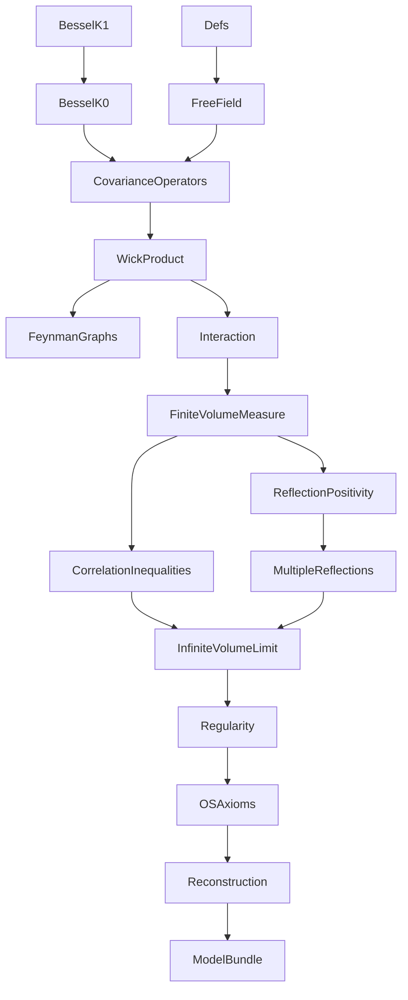
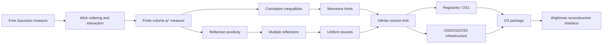
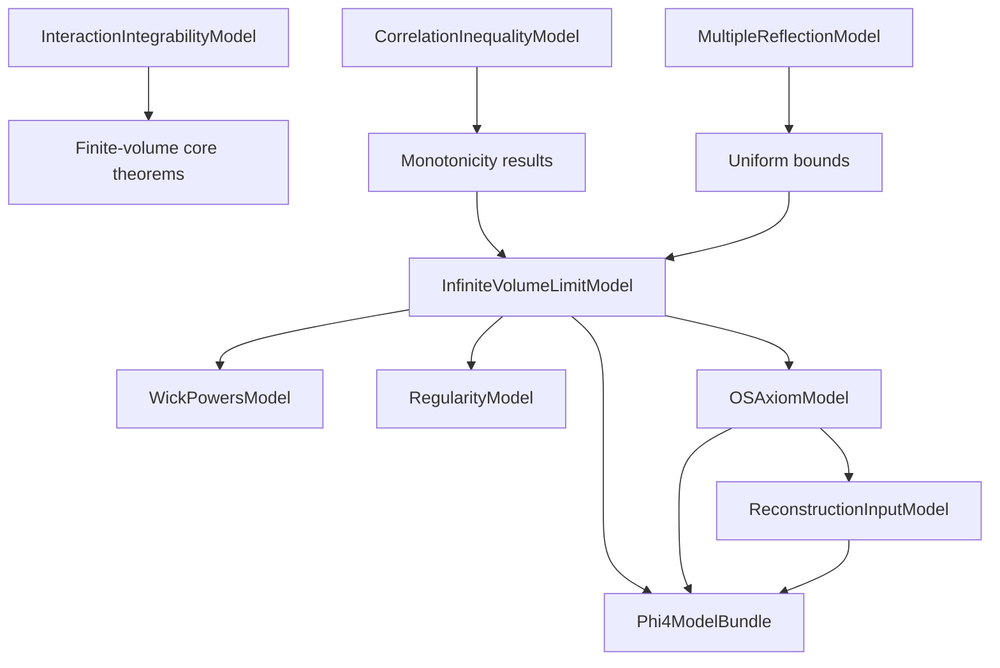

# TODO: 2D φ⁴ Project Development Plan

## Status Snapshot (2026-02-25)

- `Phi4/*.lean` has `0` `sorry`.
- `Phi4/*.lean` has `0` `axiom` declarations.
- `lake build Phi4` succeeds.
- Remaining gap to final theorem is not placeholder closure; it is replacement of high-level assumption interfaces with internal constructive proofs.

## Development Rules (Authoritative)

1. No `axiom` declarations in `Phi4`.
2. No fake placeholders or vacuous theorem statements.
3. Keep statements mathematically sound and aligned with Glimm-Jaffe.
4. Prefer proving reusable intermediate lemmas over one-off theorem hacks.

## Comprehensive Dependency / Flowchart

### A. Lean Module DAG

### B. Mathematical Proof Flow

### C. Interface-Dependency Layer (Current Architecture)

## Work Packages (Priority Order)

## WP1: Interaction Integrability Closure

Goal: replace `InteractionIntegrabilityModel` assumptions by internal proofs of the key Chapter 8 integrability statements.

Deliverables:
- prove `exp_interaction_Lp` from semibounded Wick-4 + tail control,
- derive `partition_function_pos` and `partition_function_integrable` internally,
- minimize assumptions required by `finiteVolumeMeasure_isProbability`.

Exit criteria:
- `FiniteVolumeMeasure` probability and integrability theorems no longer depend on external interaction integrability assumptions.

## WP2: Correlation + Reflection Positivity Grounding

Goal: tighten the analytic source of inequalities and positivity, reducing purely abstract interfaces.

Deliverables:
- channel-precise GKS/Lebowitz inequalities (in progress; core derived channel bounds already added),
- bridge finite-volume positivity statements to OS-style positivity forms,
- remove redundant assumptions between RP layer and OS layer where derivable.

Exit criteria:
- explicit proof path from finite-volume correlation/RP statements to the OS positivity inputs used downstream.

## WP3: Infinite-Volume Construction Upgrade

Goal: reduce `InfiniteVolumeLimitModel` by proving concrete convergence/representation steps.

Deliverables:
- strengthen monotonicity beyond the currently packaged 2-point channel,
- construct limit functionals with explicit convergence lemmas,
- prove moment representation with fewer abstract assumptions.

Exit criteria:
- at least one major field in `InfiniteVolumeLimitModel` moved from assumption to theorem.

## WP4: Regularity (OS1) Internalization

Goal: move from `RegularityModel` assumptions to proved generating-functional bounds.

Deliverables:
- formal Schwinger-Dyson / integration-by-parts chain,
- nonlocal bounds and uniform control,
- final `generating_functional_bound` theorem from project-internal lemmas.

Exit criteria:
- `phi4_os1` depends only on proven internal lemmas + clearly audited upstream results.

## WP5: OS/Reconstruction Hardening

Goal: keep final reconstruction stage sound despite upstream churn.

Deliverables:
- maintain `OSAxiomModel` with minimal, non-redundant assumptions,
- keep `ReconstructionInputModel` explicit until upstream no-sorry reconstruction theorem is auditable,
- centralize handoff through `Phi4ModelBundle`.

Exit criteria:
- clean, auditable final theorem interface showing exact remaining assumptions.

## Immediate Next Queue

1. Reduce redundancy between `OSAxiomModel.os3` and `OSAxiomModel.e2_reflection_positive` by deriving one from the other where possible.
2. Strengthen `InfiniteVolumeLimit` monotonicity infrastructure for higher-point channels.
3. Continue replacing interface-level fields with proved lemmas in `Interaction` and `FiniteVolumeMeasure`.
4. Audit and clean warning-heavy declarations (unused binders/tactics) that obscure proof intent.

## Risk Register

- Upstream `OSReconstruction` still has `sorry` in some modules; treat reconstruction usage conservatively.
- Cluster expansion / OS4 remains a major deep-analytic milestone.
- Overly abstract interfaces can drift from mathematically sharp statements; periodic statement-audit is required.
