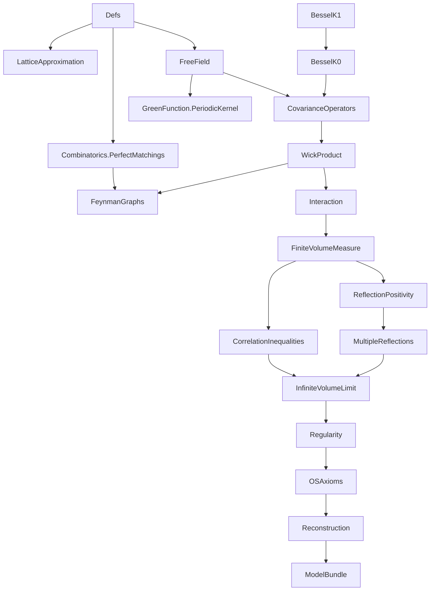
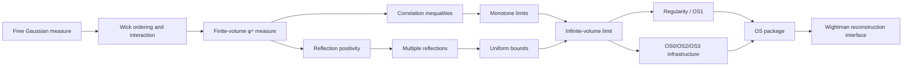
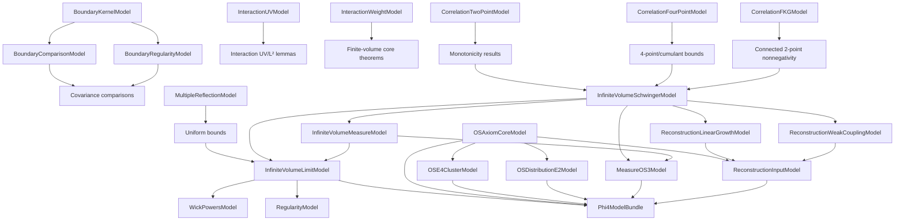

# TODO: 2D φ⁴ Project Development Plan

## Status Snapshot (2026-02-26)

- `Phi4/*.lean` has `0` `sorry`.
- `Phi4/*.lean` has `0` `axiom` declarations.
- `lake build Phi4` succeeds.
- `Phi4/LatticeApproximation.lean` now provides rectangular mesh geometry,
  discretization maps, Riemann-sum identities, and monotonicity lemmas.
- `Phi4/Combinatorics/PerfectMatchings.lean` now centralizes pairing/perfect-matching
  combinatorics for Wick/Feynman expansion infrastructure.
- `PairingEnumerationModel` now records only cardinality of pairings; enumeration
  itself is canonical via `Finset.univ`.
- `Phi4/CovarianceOperators.lean` now exposes boundary-covariance subinterfaces
  (`BoundaryKernelModel`, `BoundaryComparisonModel`, `BoundaryRegularityModel`)
  plus derived quadratic comparison lemmas (`C_D ≤ C ≤ C_N` consequences).
- `Phi4/ReflectionPositivity.lean` now requires only boundary-kernel data for
  Dirichlet RP assumptions (`BoundaryKernelModel`), consistent with the covariance split.
- `Phi4/ModelBundle.lean` now carries boundary kernel/comparison/regularity
  submodels directly; full boundary covariance is reconstructed by instance.
- `Phi4/GreenFunction/PeriodicKernel.lean` now provides concrete periodic
  image-shift and truncated lattice-sum kernel infrastructure.
- `Phi4/CorrelationInequalities.lean` now includes lattice-to-continuum
  bridge interfaces/theorems for GKS-I and 2-point monotonicity transfer,
  and now exposes correlation subinterfaces
  (`CorrelationTwoPointModel`, `CorrelationFourPointModel`, `CorrelationFKGModel`).
- `Phi4/InfiniteVolumeLimit.lean` and `Phi4/Reconstruction.lean` now use
  minimal correlation assumptions by theorem block (two-point/four-point/FKG).
- `Phi4/InfiniteVolumeLimit.lean` now exposes
  `InfiniteVolumeSchwingerModel` + `InfiniteVolumeMeasureModel`, with
  `InfiniteVolumeLimitModel` reconstructed by compatibility instance.
- Infinite-volume inequality/convergence theorem blocks in
  `Phi4/InfiniteVolumeLimit.lean` and wrappers in `Phi4/Reconstruction.lean`
  now use `InfiniteVolumeSchwingerModel` where measure representation is unused.
- `Phi4/ModelBundle.lean` now carries infinite-volume Schwinger/measure
  submodels directly and reconstructs `InfiniteVolumeLimitModel` by instance.
- `Phi4/OSAxioms.lean` now places `MeasureOS3Model` on the weaker
  Schwinger+measure assumptions, and `phi4_os3` follows this reduced interface.
- `OSAxiomCoreModel`, `OSE4ClusterModel`, and `OSDistributionE2Model` are now
  decoupled from `InfiniteVolumeLimitModel`; `phi4_satisfies_OS` now depends on
  the OS-package interfaces directly rather than a separate IV-limit hypothesis.
- `Phi4/Reconstruction.lean` now places
  `ConnectedTwoPointDecayAtParams`, `UniformWeakCouplingDecayModel`,
  `ReconstructionInputModel`, and `WightmanReconstructionModel` on
  `InfiniteVolumeSchwingerModel` rather than `InfiniteVolumeLimitModel`.
- `ReconstructionInputModel` is now split into
  `ReconstructionLinearGrowthModel` + `ReconstructionWeakCouplingModel`,
  with compatibility reconstruction kept for existing APIs.
- `Phi4/ModelBundle.lean` now stores reconstruction linear-growth and
  weak-coupling submodels directly.
- `Phi4/ModelBundle.lean` now carries correlation submodels directly; full
  `CorrelationInequalityModel` is reconstructed by instance.
- Remaining gap to final theorem is not placeholder closure; it is replacement of high-level assumption interfaces with internal constructive proofs.

## Development Rules (Authoritative)

1. No `axiom` declarations in `Phi4`.
2. No fake placeholders or vacuous theorem statements.
3. Keep statements mathematically sound and aligned with Glimm-Jaffe.
4. Prefer proving reusable intermediate lemmas over one-off theorem hacks.

## Comprehensive Dependency / Flowchart

### A. Lean Module DAG



### B. Mathematical Proof Flow



### C. Interface-Dependency Layer (Current Architecture)



## Work Packages (Priority Order)

## WP1: Interaction Integrability Closure

Goal: replace `InteractionIntegrabilityModel` assumptions by internal proofs of the key Chapter 8 integrability statements.

Deliverables:
- prove `exp_interaction_Lp` from semibounded Wick-4 + tail control,
- derive `partition_function_pos` and `partition_function_integrable` internally,
- minimize assumptions required by `finiteVolumeMeasure_isProbability`.

Exit criteria:
- `FiniteVolumeMeasure` probability and integrability theorems no longer depend on external interaction integrability assumptions.

## WP2: Correlation + Reflection Positivity Grounding

Goal: tighten the analytic source of inequalities and positivity, reducing purely abstract interfaces.

Deliverables:
- channel-precise GKS/Lebowitz inequalities (in progress; core derived channel bounds already added),
- bridge finite-volume positivity statements to OS-style positivity forms,
- remove redundant assumptions between RP layer and OS layer where derivable.

Exit criteria:
- explicit proof path from finite-volume correlation/RP statements to the OS positivity inputs used downstream.

## WP3: Infinite-Volume Construction Upgrade

Goal: reduce `InfiniteVolumeLimitModel` by proving concrete convergence/representation steps.

Progress:
- split completed: `InfiniteVolumeSchwingerModel` and `InfiniteVolumeMeasureModel`
  now isolate convergence/bounds from measure representation.

Deliverables:
- strengthen monotonicity beyond the currently packaged 2-point channel,
- construct limit functionals with explicit convergence lemmas,
- prove moment representation with fewer abstract assumptions.

Exit criteria:
- at least one major field in `InfiniteVolumeLimitModel` moved from assumption to theorem.

## WP4: Regularity (OS1) Internalization

Goal: move from `RegularityModel` assumptions to proved generating-functional bounds.

Deliverables:
- formal Schwinger-Dyson / integration-by-parts chain,
- nonlocal bounds and uniform control,
- final `generating_functional_bound` theorem from project-internal lemmas.

Exit criteria:
- `phi4_os1` depends only on proven internal lemmas + clearly audited upstream results.

## WP5: OS/Reconstruction Hardening

Goal: keep final reconstruction stage sound despite upstream churn.

Deliverables:
- maintain `OSAxiomCoreModel`/`OSE4ClusterModel`/`OSDistributionE2Model`
  with minimal, non-redundant assumptions,
- keep `ReconstructionInputModel` explicit until upstream no-sorry reconstruction theorem is auditable,
- centralize handoff through `Phi4ModelBundle`.

Exit criteria:
- clean, auditable final theorem interface showing exact remaining assumptions.

## Phased Development Plan (2026-02-26)

### Model Classes to Replace (Dependency Order)

```
Level 0: BoundaryCovarianceModel, PairingEnumerationModel
Level 1: GaussianWickExpansionModel, FreeRP, DirichletRP
Level 2: FeynmanGraphEstimateModel, InteractionUV, InteractionWeight,
         CorrelationTwoPoint, CorrelationFourPoint, CorrelationFKG, InteractingRP
Level 3: FiniteVolumeComparison, MultipleReflectionModel
Level 4: InfiniteVolumeLimitModel
Level 5: WickPowersModel, RegularityModel
Level 6: OSAxiomCoreModel (now IV-limit independent), OSE4ClusterModel,
         OSDistributionE2Model, MeasureOS3Model
Level 7: ReconstructionLinearGrowthModel, ReconstructionWeakCouplingModel, ReconstructionInputModel
```

### Phase 0: Infrastructure Foundation
- [x] **0A** (Codex): Combinatorial pairings — `Phi4/Combinatorics/PerfectMatchings.lean`
- [ ] **0B** (Claude): Boundary covariance kernels — `Phi4/GreenFunction/{Dirichlet,Neumann,Periodic}Kernel.lean`
- [x] **0C** (Codex): Lattice approximation framework — `Phi4/LatticeApproximation.lean`

### Phase 1: Gaussian Estimates & Correlation Inequalities
- [ ] **1A** (Claude): Wick expansion + graph bounds → instantiate `GaussianWickExpansionModel`, `FeynmanGraphEstimateModel`
- [ ] **1B** (Codex+Claude): Correlation inequalities via lattice/core →
      instantiate `CorrelationTwoPointModel` + `CorrelationFourPointModel` +
      `CorrelationFKGModel` (and hence `CorrelationInequalityModel`)
- [ ] **1C** (Claude): `exp_interaction_Lp` (GJ 8.6.2) → instantiate `InteractionIntegrabilityModel`

### Phase 2: Reflection Positivity & Multiple Reflections
- [ ] **2A** (Claude): Free covariance RP (Fourier space)
- [ ] **2B** (Claude): Dirichlet + interacting RP (GJ 10.4)
- [ ] **2C** (Claude): Chessboard estimate (GJ 10.5.5) + uniform bound (GJ 11.3.1) — **hardest**
- [ ] **2D** (Claude): Finite volume comparison from Lebowitz

### Phase 3: Infinite Volume Construction
- [ ] **3A** (Claude): Schwinger convergence (monotone bounded → convergent)
- [ ] **3B** (Claude): Measure construction (Bochner-Minlos or Riesz-Markov)
- [ ] **3C** (Codex): Monotonicity extension beyond k=2

### Phase 4: Regularity & OS Axioms
- [ ] **4A** (Claude): Wick powers in infinite volume (GJ 12.2.1)
- [ ] **4B** (Claude): Schwinger-Dyson equation (GJ 12.2.3)
- [ ] **4C** (Claude): Generating functional bound (GJ 12.5.1) — **most analytically demanding**
- [ ] **4D** (Codex+Claude): OS axiom packaging (OS0-OS3)

### Phase 5: Cluster Expansion & Reconstruction
- [ ] **5A** (Claude+Codex): Cluster expansion infrastructure
- [ ] **5B** (Claude): OS4 for weak coupling
- [ ] **5C** (Claude): Linear growth condition bridge
- [ ] **5D** (Codex): Wightman reconstruction bridging

### Agent Coordination
- **Claude Code**: proof-heavy tasks (PDE, analysis, MCP-assisted interactive proving)
- **Codex**: structural code generation (combinatorics, lattice framework, API packaging)

## Immediate Next Queue

1. Complete Phase 0B (Claude: boundary covariance).
2. Continue Phase 1B (Codex+Claude): instantiate lattice/core bridge models
   to discharge correlation submodel fields constructively.

## Risk Register

- Upstream `OSReconstruction` still has `sorry` in some modules; treat reconstruction usage conservatively.
- Cluster expansion / OS4 remains a major deep-analytic milestone; OS0-OS3 stand alone without it.
- Bochner-Minlos theorem for nuclear spaces likely not in Mathlib — may need axiomatization or Riesz-Markov alternative.
- Chessboard estimate / Thm 11.3.1 (uniform bound) is the hardest single analytic estimate.
- Overly abstract interfaces can drift from mathematically sharp statements; periodic statement-audit is required.
